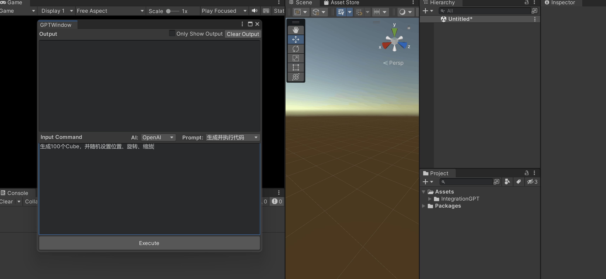
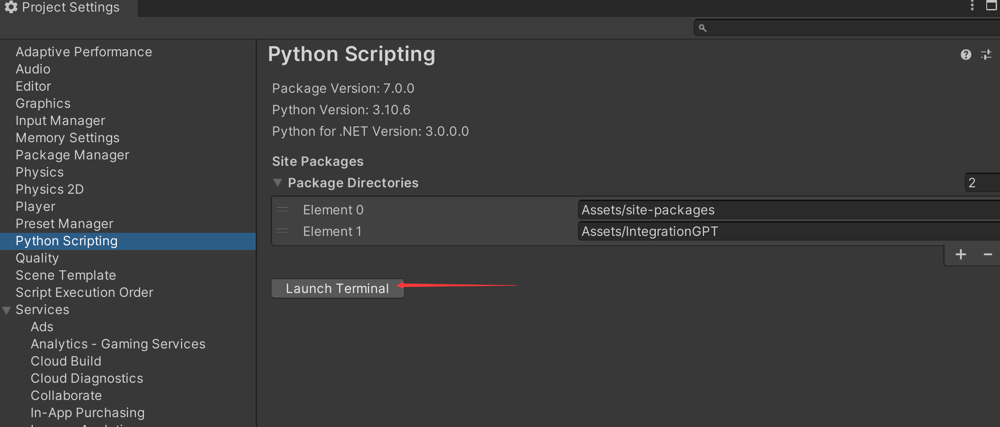
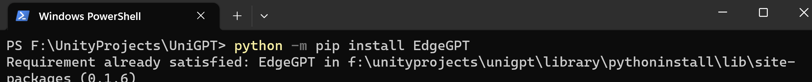
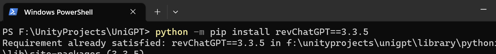

# UniGPT	[English Doc](https://github.com/tylearymf/UniGPT/blob/main/README_EN.md)

**在Unity编辑器中使用ChatGPT、BingChat来生成并执行代码。**

**输出文本支持流式传输**

---




### 安装要求

**Unity版本 >= 2019.3**

### 使用教程

#### 配置ChatGPT

1. 获取 ChatGPT 的 api_key，具体参考：https://github.com/acheong08/ChatGPT#v3-official-chat-api
2. 编辑该Json配置：Assets/IntegrationGPT/openai_config.json
3. 如果你没有代理节点的可以参考这里部署个腾讯云函数：[openai-api-proxy](https://github.com/easychen/openai-api-proxy/blob/master/FUNC.md)，然后替换掉配置中的 api_url 即可

```json
{
  # 将获取到的 api_key 替换掉下面的
  "api_key": "sk-xxxxxxxxxxxxxxxxxxxxxxxxxxxxxxxxxxxxxxxxxxxxxxxx",
  # chatgpt使用的模型
  "model": "gpt-3.5-turbo",
  # 代理设置，如果不需要则删除，在国内的必须要设置，否则无法访问openai的api
  "proxy": "http://127.0.0.1:1080",
  # 如果有国内镜像的，可以将api地址填写在这里
  # 官方API：https://api.openai.com/v1/chat/completions
  "api_url": "",
  # 这个是ChatGPT的提示语，可以根据需要增删
  "prompt": {
    "聊天": "",
	"生成并执行代码": "我想让你在Unity里面实现一个需求, 然后你给我回复代码, 你需要将实现逻辑写在TemplateClass中的Test静态方法里面, 我希望我不需要设置任何东西, 只手动调用Test方法后就能得到正确的结果, 我希望你只回复代码, 而不是其他任何内容, 不要注释.\n我的第一个需求是\n"
  }
}
```

#### 配置Bing Chat

1. 首先确保你已经加入了 Bing Chat，具体参考：https://github.com/acheong08/EdgeGPT#checking-access-required

2. 然后获取 cookies，具体参考：https://github.com/acheong08/EdgeGPT#getting-authentication-required

3. 将获取的 cookies 拷贝到 Assets/IntegrationGPT/bing_cookies.json 中

4. 编辑该Json配置：Assets/IntegrationGPT/bing_config.json

   ```json
   {
     # 对话样式
     # 更具创造力:creative 平衡:balanced 精确:precise
     "style": "precise",
     # 代理设置，如果不需要则删除，在国内的必须要设置，否则无法访问bing的api
     "proxy": "http://127.0.0.1:1080",
     # 如果有国内镜像的，可以将api地址填写在这里
     # 官方API：https://edgeservices.bing.com/edgesvc/turing/conversation/create
     "api_url": "",
     # 这个是Bing的提示语，可以根据需要增删
     "prompts": {
       "聊天": "",
       "生成并执行代码": "我想让你在Unity里面实现一个需求, 然后你给我回复代码, 你需要将实现逻辑写在TemplateClass中的Test静态方法里面, 并正确引用命名空间, 我希望我不需要设置任何东西, 只手动调用Test方法后就能得到正确的结果,我希望你只回复代码, 而不是其他任何内容, 不要注释.\n我的第一个需求是\n"
     }
   }
   ```

#### 配置Brad

1. 后续增加


### 如果出现使用不了, 请手动安装package



```
使用以下命令手动安装所需的package

python -m pip install EdgeGPT
python -m pip install revChatGPT==3.3.5
```






### 引用
- [ChatGPT](https://github.com/acheong08/ChatGPT)
- [EdgeGPT](https://github.com/acheong08/EdgeGPT)
