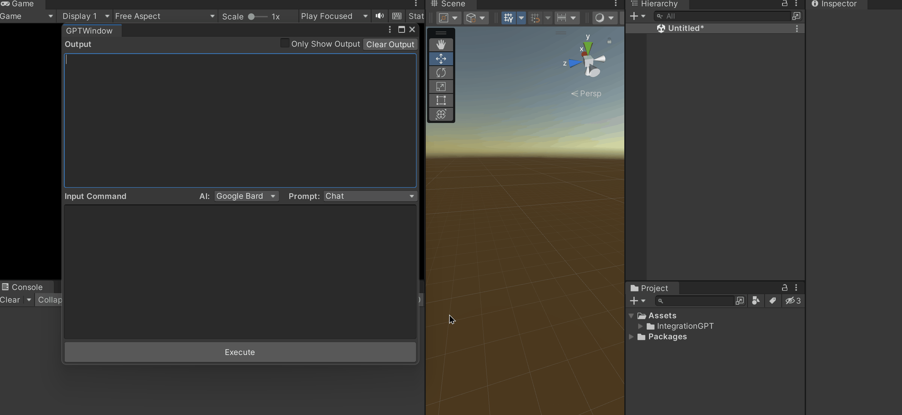

*The following content is translated by ChatGPT.*

---

# UniGPT

**Use ChatGPT, NewBing and GoogleBard to generate and execute code within the Unity editor.**

**Output text supports streaming.**

------

ChatGPT


New Bing


Google Bard




### Installation Requirements

**Unity version >= 2019.3**

### Initializing Environment

1. Open your Unity project, wait for the Python environment to finish initializing, then go to Edit -> Project Settings -> Python Scripting -> Launch Terminal (open the command-line tool)

   

2. Execute the following commands in order:

   ```bash
   python -m pip install --upgrade pip
   python -m pip install revChatGPT
   python -m pip install EdgeGPT
   python -m pip install GoogleBard
   ```

3. Follow the tutorial below to configure AI.

### Usage Tutorial

#### Configure ChatGPT

1. Obtain the api_key for ChatGPT, refer to: https://platform.openai.com/account/api-keys
2. Edit this JSON configuration: Assets/IntegrationGPT/Config~/chat_gpt_config.json

```json
{
  # Replace the api_key below with the one you obtained
  "api_key": "sk-xxxxxxxxxxxxxxxxxxxxxxxxxxxxxxxxxxxxxxxxxxxxxxxx",
  # The model used by ChatGPT, If you are a Plus user, you can change the model to gpt-4.
  "model": "gpt-3.5-turbo",
  # Proxy settings, delete if not needed. Must be set for users in China to access the openai API.
  "proxy": "http://127.0.0.1:1080",
  # If there are domestic mirror sites, you can fill in the api address here
  # Official API: https://api.openai.com/v1/chat/completions
  "api_url": "",
  # This is the prompt for ChatGPT, you can add or delete prompts as needed
  "prompt": {
    "Chat": "",
	"Generate and execute code": "I want you to implement a requirement in Unity and then reply with the code. You need to write the implementation logic in the Test static method of the TemplateClass, and correctly reference the namespace. I hope I don't need to set anything, and I can get the correct results by manually calling the Test method. I hope you only reply with the code, not any other content, and don't add comments.\nMy first requirement is\n"
  }
}
```

#### Configure New Bing

1. First, make sure you have joined New Bing, refer to: https://github.com/acheong08/EdgeGPT#checking-access-required

2. Then get the cookies, refer to: https://github.com/acheong08/EdgeGPT#getting-authentication-required

3. Copy the obtained cookies to Assets/IntegrationGPT/Config~/new_bing_cookies.json

4. Edit this JSON configuration: Assets/IntegrationGPT/Config~/new_bing_config.json

   ```json
   {
     # Conversation style
     # Creative: creative, Balanced: balanced, Precise: precise
     "style": "precise",
     # Proxy settings, delete if not needed. Must be set for users in China to access the Bing API.
     "proxy": "http://127.0.0.1:1080",
     # If there are domestic mirror sites, you can fill in the api address here
     # Official API: https://edgeservices.bing.com/edgesvc/turing/conversation/create
     "api_url": "",
     # This is the prompt for Bing, you can add or delete prompts as needed
     "prompts": {
       "Chat": "",
       "Generate and execute code": "I want you to implement a requirement in Unity and then reply with the code. You need to write the implementation logic in the Test static method of the TemplateClass, and correctly reference the namespace. I hope I don't need to set anything, and I can get the correct results by manually calling the Test method. I hope you only reply with the code, not any other content, and don't add comments.\nMy first requirement is\n"
     }
   }
   ```

#### Configure Google Bard

1. First, make sure you have joined Google Bard.

2. Then obtain the session. For details, refer to: https://github.com/acheong08/Bard#authentication

3. Edit this JSON configuration: Assets/IntegrationGPT/Config~/google_bard_config.json.

   ```json
   {
       # Session for Google Bard
       "session": "",
        # Proxy settings, delete if not needed. Must be set for users in China to access the Google API
       "proxy": "",
       # This is the prompt for Google Bard, you can add or delete prompts as needed
       "prompts":{
           "Chat": ""
       }
   }
   ```

   


### References

- [ChatGPT](https://github.com/acheong08/ChatGPT)
- [EdgeGPT](https://github.com/acheong08/EdgeGPT)
- [GoogleBard](https://github.com/acheong08/Bard)